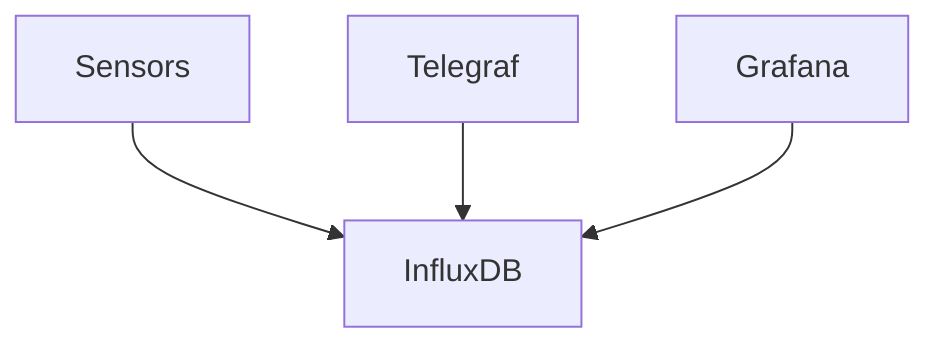

# Observability - metrics



## Building

### Building the mock sensor image.

```shell
cd sensor && docker build -t sensor .
```

### Managing secrets

Copy the env-template to .env and edit.

### Run the project

```shell
docker compose up -d
```